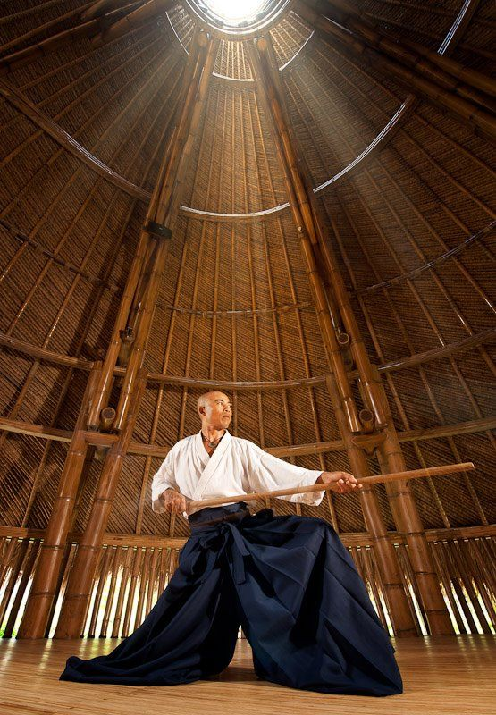
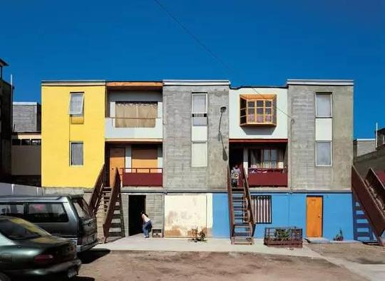

% 架构的执念
% 王福强 - fujohnwang AT gmail DOTA com
% 2016-02-18

所谓“Great Minds Think Alike”， 架构上很多东西都是相通的，架构的修行之路跟个人的修行之路随行， 如果说一个人要从`身, 心, 灵`多维度修行的话，那么，我们今天的架构话题更多是围绕着“灵（Spirit）”展开，希望跟大家一起探讨，一名合格的架构师应该拥有什么样的执念和坚守，使他/她可以在架构之路上能够引领潮流，持续前行！

# 前瞻性的眼光

合格的架构师一定需要有前瞻性的眼光。

架构不是演化出来的，摸着石头过河，遇到问题解决问题，那是专家的优势和特长， 架构师不应该关注如何精妙的去解决问题， 而应该关注如何从一开始就奠定**粗糙但正确**的蓝图和基调，避免后面投入大量的资源去应对本不该出现的各种危机。 合格的架构师都应该做扁鹊的兄长那样的人，而不是扁鹊， 扁鹊是专家的偶像。

一名合格的架构师设计出来的架构是要有前瞻性的，要为了将来的组织能力更上一个台阶而设计， 满足当下需求并能够适当扩展，是遵循架构设计的系统实现要关注的事情，系统是多样的，架构不是，系统是演化出来，架构不是。

一名合格的架构师，要目光高远的去改造“世界”， 去将高远的思想化为现实， 你要做的是冲破各种阻力， 去构建大多数世人没有见过甚至没有想过的事情。 

如果搞建筑，你要搞的是摩天大楼，甚至宇宙城堡：

而不是仅仅搭建一个遮风挡雨的栖身之所：

前者体现了架构的更高价值， 后者则只是满足需求的野蛮生长， 我并没有说两种不同的生态孰优孰劣，但作为**合格**的架构师，你要很清楚自己的选择是什么。

NASA当年给赞比亚修女的那封信， 相信大家都看过，解决眼前的问题很重要，但大部分人力和物力已经在做了， 应用，工具， 服务，所有这些都是为了解决类似的眼前问题。 所以， 作为合格的架构师， 你要做得应该是创造更高附加值的事情， 立足现状， 志存高远， 用你的前瞻性，作为先驱者， 探索， 发掘， 然后再回补， 周而复始， 走在前列。

当然， 有前瞻性不意味着你要去做一个梦想家，甚至空想家， 就跟Donald J Trump所说：

> Before the dreams lift you into the clouds, make sure you've looked hard at the fact on the ground.

你要做的，只需要基于现有资源和环境，挖掘架构需求背后的本质， 做出高于普通标准的方案就可以了。 这跟艺术上经常说的“源于生活，又高于生活”是同样的道理。

前阵子在自己的朋友圈看到一篇介绍智利的建筑设计师凭借“杀手级设计-半个房子(Half A House)”获得普利兹克奖的故事， 而这个半个房子的设计，实际上就是很好的前瞻性设计的典范：

设计者基于现有资源和环境给出了以上的设计， 然后希望后面的住户根据自己的经济实力和需求自行建设和装修， 而后面各个半个房子的演化也很好的证明了设计者的预想：

看，这就是前瞻性的眼光！

# 系统性的思考

合格的架构师都是好的战略家， 前瞻性眼光是他们起码的要求， 而系统性的思考则是将这些前瞻性眼光落地的必备素质。

架构既看重前瞻， 又看重落地，落不了地的架构只是空中楼阁， 所以， 如何将架构落地， 考量的就是一名合格架构师的综合素质和系统思考的能力。 

因为架构的规划和落地依附于现有的环境因素很多且不可重现， 所以， 合格的架构师要能够尽可能多的将对架构有过多权重影响的因素考量进来，然后做权衡， 抓住重点因素， 最后集中兵力重点突破。 

比如， 是采用传统的Monolith架构体系，还是时下风靡的微服务架构体系， 你要能够从团队人员层次和能力， 组织和公司的发展现状， 时机等重点因素中做出权衡， 你没法通过数据建模的手段去完成这个工作， 你能依靠的，只有你的综合素质和系统思考能力：

- 从时机(Timing)上说， 如果单个应用结点就可以满足业务发展需求，那么， 就没有必要上微服务，否则反而凭空增加了整个交付链路的负担； 

- 如果团队的成员能力还不足以支撑起微服务体系相关的所有工具化，服务化和平台化建设， 那么微服务架构也不是最合适的方向；

- 如果公司业务还处在四处拼杀， 生死未卜的时候， 公司的现状也不会允许你去搞各种完善的基础性建设， 活下来才是第一位的；

对于架构师来说， 你要关注的不是“点”， 而应该关注的是尽可能多的“点”， 进而是连接点的线， 到面，甚至到体， 你要构建的是“人浪”的整体形态， 而不是指导“人浪”中某个人的“起立和坐下”， 你要关注的是“整体效率”， 而不是"单点效率"， 否则就不是`健不健，美不美`的问题了：

系统性思维帮助做出合理的决策， 但最终都是为了架构的落地而服务，所以， 在繁杂的系统因素中做出抉择之后， 要能够集中兵力攻占阵地， 这个时候考验的则是架构师的统筹和带兵打仗的能力， 你可以使用情感纽带将兄弟们团结在一起为了同一目标而奋斗， 你也可以政教合一， 像亚马逊那样通过行政上的强化，来保证“所有服务都必须HTTP化”类似的决策执行， “路怎么走， 你们看着办咯~”

> No man ever steps into the same river twice!

# 开放性的心态

前瞻性的眼光， 系统性的思考能力不是凭空而来的， 你需要“海纳百川”， 去芜存菁，然后通过独立的思考，经过长时间的积累，持续沉淀为一名合格架构师的综合素质， 而开放性心态是那道坎儿， 你迈不过去， 持续的沉淀就无从谈起。

一名合格的架构师是一座冰山， 他给你的印象可能只是很平常的小冰块儿， 但实在货都沉淀在下面：

而且， 在开放的心态下， 下面的沉淀将持续壮大。

## 有了开放性的心态，你才能“接纳差异”，做出合理的权衡

对于技术人来说， 或者说骨子里就是为技术而生的人， 与生俱来会有一种特质，那就是**专注**。 这种专注的特质可以让人沉浸在技术的海洋中欣喜而不可自拔， 但是， 不能因为这， 就忽略了千差万别的人，就忽略了斑驳陆离的世界。

我们不是一个个的“孤岛”，我们需要与不同的人，团队，组织打交道， 虽然我们为自己作为一名技术人和架构师而自豪，但不能因此而“老子天下最牛”， 即使是同一团队中， 针对同一需求，也会存在不同的声音，作为架构师， 我们不一定要听得进去，但起码要能听到，因为做架构本质上是要有一定的集权性的， 接纳众多意见，最终还是要归一为同一个方案，只是，集权不意味着武断， 接纳也不意味着民主， 但起码要知道有差异， 以及这些差异是否是当前架构需求的重点影响因素， 只有开放言路， 开放心态， 接纳人的差异， 组织的差异，才能帮助我们当时当下做出最为合理的权衡和架构决策。

推荐各位架构师去了解一些像MBTI之类的人格理论， 或许对了解人之间的差异会有帮助，空谈要心态开放可能意义不大， 倒是不妨先从了解人与人之间的差异开始吧！

## 有了开放性的心态，你才不会被过往的经验所羁绊

过去的经验有些时候不一定是财富， 有时候反而往往成了障碍。

一个公司在快速发展阶段，往往会快速吸纳来自不同公司和组织文化的人员， 而吸纳这些人员的初衷其实也正是能够直接应用他们之前的经验， 但实际上， 并非所有人员和他们的经验都是对当前公司和组织有益的。 大部分架构师或者技术专家都会对自己的“孩子”关爱有加，但往往也会被这种“爱”蒙蔽了双眼， 觉得什么都是好的，所以， 将原来的劳动成果照搬过来也就不是什么不可理解的行为了， 但是， 像`基于HBASE的小文件存储`这样的设计和系统，如果别人告诉你，该方案的设计和实践的基石不合适，你却听不进去，还要争辩说这套小文件存储的设计和系统在原来公司运行的好好的云云，那么， 从心态到过往的经验，对个人其实都是一种羁绊。

舍得，舍得， 只有舍了，才能得，杯子空了，才可以重新装入新的液体！

## 有了开放性的心态， 你才会走上成长为一名合格[架构师的莫比乌斯之路](http://afoo.me/posts/2014-05-18-architect-is-not-the-one-you-think.html)！

相信“在座”的很多人都打过游戏吧？ 游戏之旅我们通常戏称为“打怪升级”之路， 我通常为了鼓励创业者能够跳出来勇敢地去折腾，也会用“打怪升级”来形容创业的过程， 而话说回来， 架构之路，实际上也是一条“打怪升级”之路。

大部分架构师会在整个生命周期内接触不同层面，不同领域的工作内容，做过应用开发，做过数据库和系统管理，做过中间件，也做过大数据，还做过..., 甚至你还可能还有公司和组织架构的经验。 但不管怎么样，只有你有了一颗开放的心态，才可以保证自己能够持续的沿着那条看似毫无尽头但却精彩绝伦的[架构师的莫比乌斯之路](http://afoo.me/posts/2014-05-18-architect-is-not-the-one-you-think.html)前行。

# Be A Full-Life Learner!

我今天要讲的最后一点就是， Be A Full-Life Learner!

技术很多时候是撬动人类历史快速向前发展的核心因素之一， 火药的发明引发了从烟花，到火炮，火绳枪，燧发枪， 连发枪的持续演化， 而且演化迭代的速度也是越来越快； 商业上也是同样的道理，如果说原来的电话普及是数十年才填满市场，那么现在的智能手机则只是短短的几年； 

一名合格的架构师在这个快速发展的背景下，只有不断持续的学习，才能跟得上时代的步伐，才能不让自己成为团队和组织的瓶颈，才能持续的做出自身的贡献，所以，要沿着架构之路坚持的走下去，就去做一名终身的学习者吧！ 

你说那？;-)

