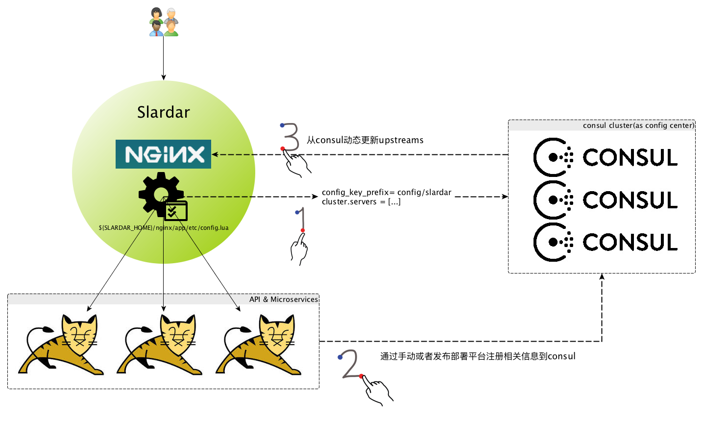

% 使用consul和又拍云slardar构建API网关
% 王福强 - fujohnwang AT gmail DOTA com
% 2017-01-28

# 基本概念介绍

对于横切关注点来说， J2EE时代的servlet Filter是很典型的落地方式。 但是随着微服务理念的流行， 即使将Filter作为“挂结点”而将核心关注点实现逻辑剥离为单独服务的做法也不是做彻底的微服务实践方式， 因为Filter一般情况下还是会随着web层业务应用一起部署， 关注点剥离不彻底， 更新， 维护相互影响，所以， API网关的做法就应运而生了。

将所有横切关注点独立开发和部署为前置系统， 作为后端所有微服务和API的访问入口， 对微服务和API进行审计，流控， 监控，计费等， 这样的前置系统就称为API网关(API Gateway)。


# 潜在预选方案

## 应用层方案

最有名的当然是Netflix的zuul， 但这不意味着这种方案就最适合你， 比如Netfilx是因为使用AWS，对基础设施把控有限， 所以才不得不在应用层做了zuul这样的方案，如果通盘考虑， 这种方案不是最合适或者说最有的方案。

但如果自己的团队对整体技术设施把控有限，且团队结构不完善，应用层方案也可能是最适合你的“快糙猛”最佳方案。

## 增强现有基础设施方案
最典型的就是使用nginx + lua方案， 也是扶墙老师认为最合适的方案。

[OpenResty](http://openresty.org/)和[Kong](https://getkong.org/)是比较成熟的可选方案， 不过Kong使用Postgres或者Cassandra， 国内公司估计选择这俩货的不多。 但Kong的HTTP API设计还是很不错的， 👍

至于OpenResty， 如果有lua高手，可以完全把控，那也是正选， 可惜扶墙老师和团队都不是此中能手， 没法很好的把控，而OpenResty又是一个比较通用的方案，不像Kong那样是特定的API Gateway方案，所以，无法把控的情况下，暂且不考虑之。


## 最终选择

去年又拍云在深圳组织了一次OpenResty的大会， 在跟又拍云的同学要来相关slides浏览学习的时候，发现了又拍云提供的slardar是一个比较合适的选择，主要是：

1. 配合consul使用，虽然扶墙老师是Java出身， 选择zookeeper会是更加自然的选择，但作为新锐派，又有之前不二的压测结果支撑， 我现在更加倾向于使用consul了；
2. 良好的HTTP API支持， 可以动态管理upstreams， 这也意味着我们可以通过发布平台或者胶水系统无缝的实现服务注册和发现， 对服务的访问方透明；

另外就是， 跟又拍云的同学可以联系配合，有问题可以协助解决，所以最终选择了slardar！

# 方案设计与实施



整个方案的Big Picture如上：

1. consul作为状态存储或者说配置中心（主要使用consul的KV存储功能）；slardar(nginx)作为API网关， 根据consul中upstreams的相关配置，动态分发流量到配置的upstreams结点；
2. slardar根据config.lua中`cluster.servers`配置项， 连接到consul集群；
3. 启动的API或者微服务实例， 通过手工/命令行/发布部署平台， 将实例信息注册/写入consul;
4. slardar获取到相应的upstreams信息更新， 则动态变更nginx内部的upstreams分发配置，从而将流量路由和分发到对应的API和微服务实例结点；

将以上注册和发现逻辑通过脚本或者统一的发布部署平台固化后，就可以实现透明的服务访问和扩展。


## 安装和启动consul

mac上安装consul很简单， 直接`brew install consul`。

因为是本地的原型系统，所以， 我们使用如下命令启动一个consul server结点：

```
consul agent -server -data-dir ~/consul.datastore -bind=172.20.10.5 -bootstrap-expect=1
```

如果是生产环境， 最好将-bootstrap-expect的数量设置为3或者5，以便consul集群有一定的fault tolerance能力。

## 安装和启动slardar

[Slardar项目](https://github.com/upyun/slardar)的README.md有很相近的安装和配置说明， 我们选择源码编译安装：

```
git clone https://github.com/upyun/slardar.git
cd slardar
brew install wget gcc gcc-c++ patch zlib-devel
make configure
make
make install
```

其中， `brew install wget gcc gcc-c++ patch zlib-devel`是参考Dockerfile中需要的编译依赖，转换为mac下的依赖安装命令。

一般情况下， 编译和安装会成功完成， 之后，只要执行如下命令，启动slardar即可：

`/usr/local/slardar/nginx/sbin/nginx`

> 要关闭，执行`/usr/local/slardar/nginx/sbin/nginx -s stop`


# 管理与运维

slardar默认的HTTP管理API端口是1995， 而nginx的对外服务端口是8080， 如果愿意，我们可以通过变更`/usr/local/slardar/nginx/conf/slardar/service.conf`将8080修改为80端口。

默认情况下，我们没有配置任何的域名与upstreams映射信息，所以访问localhost会返回502 Bad Gateway。 

演示用， 我们启动一个mkdocs文档服务：

```
➜  mkdocs git:(master) ✗ mkdocs serve
INFO    -  Building documentation...
INFO    -  Cleaning site directory
[I 170129 16:35:41 server:283] Serving on http://127.0.0.1:8000
[I 170129 16:35:41 handlers:60] Start watching changes
[I 170129 16:35:41 handlers:62] Start detecting changes
```

然后，我们通过slardar的HTTP管理API将这个mkdocs服务的HTTP结点动态更新为upstreams之一：

```
➜  ~ curl 127.0.0.1:1995/upstream/localhost -d '{"servers":[{"host":"127.0.0.1", "port": 8000}]}'
{"status":200}%
```

现在访问`http://localhost`(而不是`http://localhost:8000`)就可以直接访问到这个mkdocs服务啦， 如果愿意，我们可以启动多个mkdocs文档服务结点，并均注册为localhost的upstreams结点。

# TODO

目前为止， slardar和consul更多只是作为服务注册和发现的基础设施（接入网关）， 要让slardar作为API Gateway进行服务， 还需要更多lua编程， 此为后话， stay tuned~


# 附加说明

## slardar/nginx启动错误


```
➜  nginx sudo /usr/local/slardar/nginx/sbin/nginx
nginx: [error] [lua] consul.lua:39: get_servers(): get config from http://127.0.0.1:8500/v1/kv/config/slardar/upstreams?keys failed
nginx: [error] [lua] consul.lua:60: get_script_blocking(): get config from http://127.0.0.1:8500/v1/kv/config/slardar/lua/?keys failed
nginx: [warn] [lua] load.lua:234: no code in consul
```

> 这个错误不影响slardar/nginx的启动， 原因和如何消弭这里不做说明。


## 接入网关(LB Gateway) VS. API Gateway

接入网关更多负责接入层的流量负载均衡和路由， 而API Gateway做得不仅仅只是一个LB或者路由的事情。 API Gateway可以附加更多像审计，计费， 监控，安全防控等各种功能关注点。

